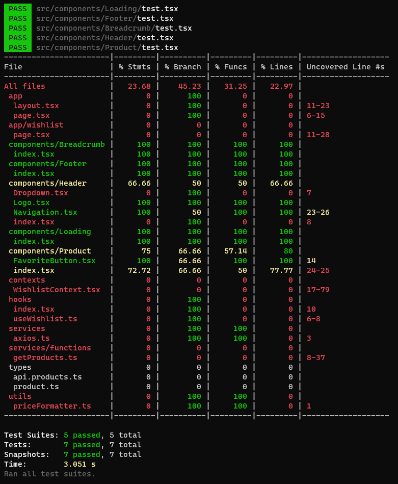

<div align="left">
  
</div>

<br/>

<div align="center">
  
</div>

<br/>

<div align="center">
  <h1>Wishlist</h1>
  <h3>Uma aplicação web responsiva desenvolvida com <a href="https://nextjs.org/">NextJS</a>, integrando-se à API da empresa Luiza Labs. Neste aplicativo, é possível visualizar uma lista de produtos, oferecendo ao usuário a facilidade de adicionar itens à lista de favoritos.</p>
</div>

<div align="center">
  
  
  
  
  
</div>

<br/>

<div align="center">
  <a href="#tecnologias">Tecnologias</a> •
  <a href="#como-usar">Como usar</a> •
  <a href="#decisões-técnicas">Decisões Técnicas</a> •
  <a href="#desafios">Desafios</a> •
  <a href="#melhorias">Melhorias</a> •
  <a href="#contato">Contato</a>
</div>

<br/>

<div>
  <h3>Demo Frontend: <a href="https://wishlist-pi.vercel.app/">https://wishlist-pi.vercel.app/</a></h3>
</div>

<div>
  <h2 id="tecnologias">Tecnologias:</h2>
  <h3>Linguagens e Ferramentas:</h3>
  <ul>
    <li>NextJS</li>
    <li>TypeScript</li>
  </ul>

  <h3>Frontend:</h3>
  <ul>
    <li>TailwindCSS</li>
    <li>RadixUI</li>
  </ul>

  <h3>Testes:</h3>
  <ul>
    <li>Jest</li>
    <li>Testing Library</li>
  </ul>

  <h3>Padronização de Código:</h3>
  <ul>
    <li>ESLint</li>
    <li>Prettier</li>
  </ul>

  <h3> Framework HTTP:</h3>
  <ul>
    <li>Axios</li>
  </ul>
</div>

<div>
  <h2 id="como-usar">Como usar:</h2>
  <h3>Requisitos:</h3>
  <p>
    Antes de iniciar, certifique-se de ter instalado em sua máquina as seguintes ferramentas:
  </p>

  <ul>
    <li>Git</li>
    <li>Node (Versão mínima 18)</li>
    <li>NPM</li>
  </ul>

  <h3>Clone o projeto e acesse a pasta:</h3>

  ```bash
  $ git clone git@github.com:vitoremanuelqf/wishlist.git && cd challenge-charlie
  ```

  <h3>Siga os passos abaixo para executar a aplicação localmente:</h3>

  ```bash
  # Certifique-se de que todas as variáveis de ambiente possuem as chaves das APIs ativas.

  $ npm i

  $ npm run dev
  ```

  <h3>Para executar os testes:</h3>

  ```bash
  $ npm run test

  $ npm run test:watch
  ```

  
</div>

<br/>

<div>
  <h2 id="decisões-técnicas">Decisões Técnicas:</h2>
  <h3>NextJS:</h3>
  <p>O Next.js é conhecido por oferecer suporte para renderização do lado do servidor, o que pode melhorar significativamente o desempenho da página, especialmente em conexões de internet mais lentas. Quanto a performance, o Next.js é projetado para oferecer o melhor desempenho, utilizando estratégias como o pré-carregamento de páginas e o lazy loading para melhorar o tempo de carregamento.</p>

  <h3>TailwindCSS:</h3>
  <p>O Tailwind CSS é uma estrutura de design CSS utilitária que serve para simplificar e acelerar o desenvolvimento de interfaces de usuário. Suas vantagens incluem produtividade rápida, configurabilidade para atender às necessidades do projeto, promoção da consistência visual, manutenção simplificada do código, flexibilidade para diferentes estilos de desenvolvimento, redução de tamanho de arquivos CSS e um ecossistema ativo com plugins e ferramentas adicionais. Em resumo, o Tailwind CSS é escolhido por sua eficiência, simplicidade e capacidade de oferecer uma experiência de desenvolvimento coesa.</p>

  <h3>Axios:</h3>
  <p>O Axios é uma biblioteca JavaScript utilizada para realizar requisições HTTP em aplicações web. Ele oferece uma sintaxe simples e consistente, suporta Promises, funciona tanto em navegadores quanto no Node.js, possibilita interceptação de requisições e respostas, e permite o cancelamento de requisições. Essa ferramenta é amplamente adotada devido à sua simplicidade, facilidade de uso e versatilidade em ambientes cliente e servidor.</p>

  <h3>Localstorage:</h3>
  <p>O uso do Local Storage para armazenar dados em aplicativos web oferece vantagens como persistência local, desempenho rápido, simplicidade de uso, redução de cargas no servidor, suporte offline e ampla compatibilidade com navegadores. No entanto, é importante considerar suas limitações, como o espaço de armazenamento limitado e a falta de segurança para dados sensíveis. Em resumo, o Local Storage é uma opção eficiente e conveniente para armazenamento local de dados, especialmente para preferências de usuário e informações não críticas à segurança.</p>
</div>

<div>
  <h2 id="desafios">Desafios:</h2>
  <p>Desenvolver e executar testes utilizando Jest e React Testing Library, já que essa não é uma atividade comum no meu cotidiano profissional, e meu entendimento até agora foi principalmente teórico.</p>
</div>

<div>
  <h2 id="melhorias">Melhorias:</h2>
  <p>Algumas informações essenciais estão ausentes na resposta da API, tais como o preço total, o preço com desconto e a pontuação da avaliação.</p>
</div>

<div>
  <h2 id="contato">Contato:</h2>
  <h3>Estou à disposição para esclarecer dúvidas, receber sugestões ou lidar com críticas. Não hesite em entrar em contato!</h3>

  <p>Email: vitoremanuelqf@gmail.com</p>
  <p>WhatsApp: (15) 99605-5714</p>
  <p>LinkedIn: <a href="https://www.linkedin.com/in/vitoremanuelqf">https://www.linkedin.com/in/vitoremanuelqf</a></p>

  <h3>Obrigado pela oportunidade!</h3>
</div>
